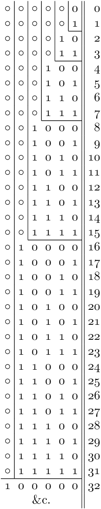

# Explication de l'arithmétique binaire
 
*Gottfried Wilhelm von Leibniz, 1703*

Le calcul ordinaire d’Arithmétique se fait suivant la progression de dix en dix. On se sert de dix caractères, qui sont 0, 1, 2, 3, 4, 5, 6, 7, 8, 9, qui signifient zéro, un et les nombres suivants jusqu’à neuf inclusivement. Et puis allant à dix, on *recommence, et on écrit dix par 10, et dix fois dix ou cent par 100, et dix fois cent ou mille par 1000, et dix fois mille par 10 000, et ainsi de suite.

Mais au lieu de la progression de dix en dix, j’ai employé depuis plusieurs années la progression la plus simple de toutes, qui va de deux en deux, ayant trouvé qu’elle sert à la perfection de la science des Nombres. Ainsi je n’y emploie point d’autres caractères que 0 et 1, et puis allant à deux, je recommence. C’est pourquoi deux s’écrit ici par 10, et deux fois deux ou quatre par 100, et deux fois quatre ou huit par 1000, et deux fois huit ou seize par 10 000, et ainsi de suite. Voici la Table des Nombres de cette façon, qu’on peut continuer tant que l’on voudra

## Table des nombres

> source : https://tex.stackexchange.com/questions/233177/how-would-you-reproduce-the-leibniz-binary-table

On voit ici d’un coup d’oeil la raison *d’une propriété célèbre de la progression géométrique double* en Nombres entiers, qui porte que si on n’a qu’un de ces nombres de chaque degré, on en peut composer tous les autres nombres entiers au-dessous du double du plus haut degré. Car ici, c’est comme si on disait par exemple, que 111 ou 7 est la somme de quatre, de deux et de un, et que 1101 ou 13 est la somme de huit, quatre et un. Cette propriété sert aux Essayeurs pour peser toutes sortes de masses avec peu de poids et pourrait servir dans les monnaies pour donner plusieurs valeurs avec peu de pièces.