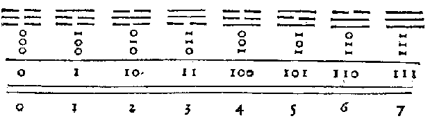

# Explication de l'arithmétique binaire
 
*Gottfried Wilhelm von Leibniz, 1703*

Le calcul ordinaire d’Arithmétique se fait suivant la progression de dix en dix. On se sert de dix caractères, qui sont 0, 1, 2, 3, 4, 5, 6, 7, 8, 9, qui signifient zéro, un et les nombres suivants jusqu’à neuf inclusivement. Et puis allant à dix, on *recommence, et on écrit dix par 10, et dix fois dix ou cent par 100, et dix fois cent ou mille par 1000, et dix fois mille par 10 000, et ainsi de suite.

Mais au lieu de la progression de dix en dix, j’ai employé depuis plusieurs années la progression la plus simple de toutes, qui va de deux en deux, ayant trouvé qu’elle sert à la perfection de la science des Nombres. Ainsi je n’y emploie point d’autres caractères que 0 et 1, et puis allant à deux, je recommence. C’est pourquoi deux s’écrit ici par 10, et deux fois deux ou quatre par 100, et deux fois quatre ou huit par 1000, et deux fois huit ou seize par 10 000, et ainsi de suite. Voici la Table des Nombres de cette façon, qu’on peut continuer tant que l’on voudra

## Table des nombres

> figure a - source : https://tex.stackexchange.com/questions/233177/how-would-you-reproduce-the-leibniz-binary-table

On voit ici d’un coup d’oeil la raison *d’une propriété célèbre de la progression géométrique double* en Nombres entiers, qui porte que si on n’a qu’un de ces nombres de chaque degré, on en peut composer tous les autres nombres entiers au-dessous du double du plus haut degré. Car ici, c’est comme si on disait par exemple, que 111  ou 7(figure b) est la somme de quatre, de deux et de un, et que 1101 ou 13 (figure c) est la somme de huit, quatre et un. Cette propriété sert aux Essayeurs pour peser toutes sortes de masses avec peu de poids et pourrait servir dans les monnaies pour donner plusieurs valeurs avec peu de pièces.

> figure b - somme de 111 ou 7 :

|  base 2 |  base 10  | 
|---:|---:|
| 100 | 4 |
|  10 | 2 |
|   1 | 1 |
|  **111**| **7** |

> figure c - somme de 1101 ou 13

|  base 2 |  base 10  | 
|---:|---:|
| 1000 | 8 |
|  100 | 4 |
|    1 | 1 |
|  **1101**| **7** |

Cette expression des Nombres étant établie, sert à faire très facilement toutes sortes d’opérations.

Et toutes ces opérations sont si aisées, qu’on n’a jamais besoin de rien essayer ni deviner, comme il faut faire dans la division ordinaire. On n’a point besoin non plus de rien apprendre par cœur ici, comme il faut faire dans le calcul ordinaire, où il faut savoir, par exemple, que 6 et 7 pris ensemble font 13, et que 5 multiplié par 3 donne 15, suivant la Table d’une fois un est un, qu’on appelle Pythagorique. Mais ici tout cela se trouve et se prouve de source, comme l’on voit dans les exemples précédents sous les signes ★ et ⊙.

Cependant je ne recommande point cette manière de compter, pour la faire introduire à la place de la pratique ordinaire par dix. Car outre qu’on est accoutumé à celle-ci, on n’y a point besoin d’y apprendre ce qu’on a déjà appris par cœur : ainsi la pratique par dix est plus abrégée, et les nombres y sont moins longs. Et si l’on était accoutumé à aller par douze ou par seize, il y aurait encore plus d’avantage. Mais le calcul par deux, c’est-à-dire par 0 et par 1, en récompense de sa longueur, est le plus fondamental pour la science, et donne de nouvelles découvertes, qui se trouvent utiles ensuite, même pour la pratique des nombres, et surtout pour la Géométrie, dont la raison est que les nombres étant réduits aux plus simples principes, comme 0 et 1, il paraît partout un ordre merveilleux. Pour exemple, dans la Table même des Nombres, on voit en chaque colonne régner des périodes qui recommencent toujours. Dans la première colonne c’est 01, dans la seconde 0011, dans la troisième 00001111, dans la quatrième 0000000011111111, et ainsi de suite. Et on a mis de petits zéros dans la Table pour remplir le vide au commencement de la colonne, et pour mieux marquer ces périodes. On a mené aussi des lignes dans la Table, qui marquent que ce que ces lignes renferment revient toujours sous elles. Et il se trouve encore que les Nombres Carrés, Cubiques et d’autres puissances, item les Nombres Triangulaires, Pyramidaux et d’autres nombres figurés, ont aussi de semblables périodes, de sorte que l’on peut écrire les Tables tout de suite, sans calculer. Et une prolixité dans le commencement, qui donne ensuite le moyen d’épargner le calcul et d’aller à l’infini par règle, est infiniment avantageuse.

Ce qu’il y a de surprenant dans ce calcul, c’est que cette Arithmétique par 0 et 1 se trouve contenir le mystère d’un ancien Roi et Philosophe nommé Fohy, qu’on croit avoir vécu il y a plus de quatre mille ans et que les Chinois regardent comme le Fondateur de leur Empire et de leurs sciences. Il y a plusieurs figures linéaires qu’on lui attribue, elles reviennent toutes à cette Arithmétique ; mais il suffit de mettre ici la Figure de huit Cova comme on l’appelle, qui passe pour fondamentale, et d’y joindre l’explication qui est manifeste, pourvu qu’on remarque premièrement qu’une ligne entière **—** signifie l’unité ou 1, et secondement qu’une ligne brisée **– –** signifie le zéro ou 0.

